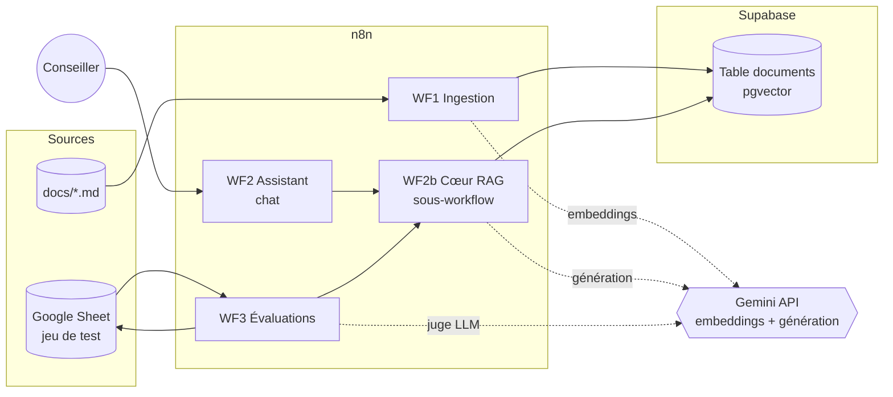
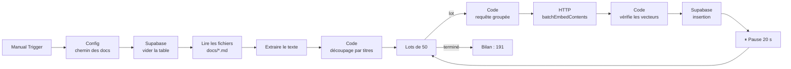
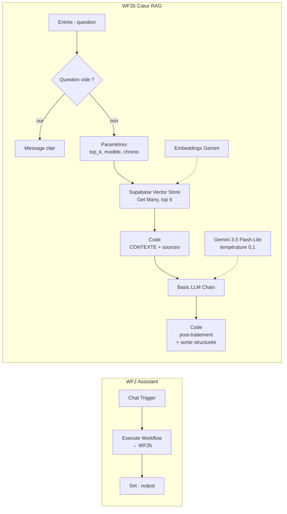
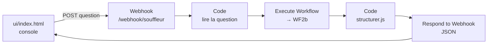
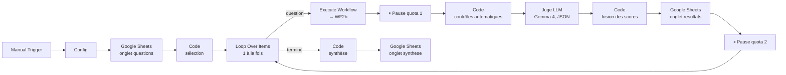

# Architecture – Assistant IA pour conseillers Kalyo Télécom

> Statut : **validée (phase 2) et construite (phase 3)**. Les nœuds et leurs versions ont été vérifiés sur l'instance cible : **n8n 1.122.5 auto-hébergé**. Les workflows sont dans [`workflows/`](workflows/).

## 1. Vue d'ensemble



**Décision centrale : un seul « cœur RAG » partagé.** La recherche des passages et la génération de la réponse vivent dans un sous-workflow (WF2b), appelé à la fois par le chat (WF2) et par les évaluations (WF3). **Les évaluations mesurent donc exactement le code utilisé en production.**

| Workflow | Nom dans n8n | Fichier | Déclencheur |
|---|---|---|---|
| WF1 | `Souffleur – 1 Ingestion` | `workflows/wf1-ingestion.json` | Manuel |
| WF2 | `Souffleur – 2 Assistant (chat)` | `workflows/wf2-assistant-chat.json` | Message dans la fenêtre de chat n8n |
| WF2b | `Souffleur – 2b Cœur RAG` | `workflows/wf2b-coeur-rag.json` | Appelé par un autre workflow |
| WF3 | `Souffleur – 3 Évaluations` | `workflows/wf3-evaluations.json` | Manuel |
| WF4 | `Souffleur – 4 API console` | `workflows/wf4-api-console.json` | `POST /webhook/souffleur` (console `ui/index.html`) |

### 1.1 Nœuds vérifiés sur l'instance (n8n 1.122.5)

Vérification faite en lisant les définitions de nœuds de l'installation locale, et en passant les 4 workflows à un validateur de workflows n8n (0 erreur).

| Nœud | Type | Version utilisée | Workflows |
|---|---|---|---|
| Manual Trigger | `n8n-nodes-base.manualTrigger` | 1 | WF1, WF3 |
| Edit Fields (Set) | `n8n-nodes-base.set` | 3.4 | tous |
| Supabase | `n8n-nodes-base.supabase` | 1 | WF1 (purge et insertion) |
| HTTP Request | `n8n-nodes-base.httpRequest` | 4.2 | WF1 (embeddings par lot) |
| Read/Write Files from Disk | `n8n-nodes-base.readWriteFile` | 1 | WF1 |
| Extract from File | `n8n-nodes-base.extractFromFile` | 1.1 | WF1 |
| Code | `n8n-nodes-base.code` | 2 | WF1, WF2b, WF3 |
| Supabase Vector Store | `@n8n/n8n-nodes-langchain.vectorStoreSupabase` | 1.3 | WF2b |
| Embeddings Google Gemini | `@n8n/n8n-nodes-langchain.embeddingsGoogleGemini` | 1 | WF2b (question) |
| Execute Workflow Trigger | `n8n-nodes-base.executeWorkflowTrigger` | 1.1 | WF2b |
| Basic LLM Chain | `@n8n/n8n-nodes-langchain.chainLlm` | 1.7 | WF2b, WF3 |
| Google Gemini Chat Model | `@n8n/n8n-nodes-langchain.lmChatGoogleGemini` | 1 | WF2b, WF3 |
| Chat Trigger | `@n8n/n8n-nodes-langchain.chatTrigger` | 1.3 | WF2 |
| Execute Workflow | `n8n-nodes-base.executeWorkflow` | 1.3 | WF2, WF3 |
| Google Sheets | `n8n-nodes-base.googleSheets` | 4.7 | WF3 |
| Loop Over Items | `n8n-nodes-base.splitInBatches` | 3 | WF1, WF3 |
| Wait | `n8n-nodes-base.wait` | 1.1 | WF1, WF3 |

**Points relevés pendant la vérification :**
- Le catalogue de nœuds utilisé par le validateur décrit n8n 2.x, avec des versions de nœuds plus récentes que celles de l'instance (ex. Basic LLM Chain 1.9 au lieu de 1.7). Les workflows utilisent les **versions de l'instance**.
- Le nœud *Embeddings Google Gemini* propose par défaut `text-embedding-004`, un ancien modèle. Le modèle `gemini-embedding-001` est donc choisi explicitement. Le nœud ne permet pas de choisir la dimension des vecteurs : on garde celle par défaut du modèle (3 072).
- Les nœuds Evaluation natifs (`evaluation`, `evaluationTrigger`) existent sur l'instance, mais ne sont pas utilisés (voir 4.3).

---

## 2. WF1 – Ingestion



| Étape | Nœud | Rôle |
|---|---|---|
| 1 | Config (Set) | Chemin des documents (`docs_glob`), seul paramètre à adapter |
| 2 | Supabase – Delete (`id=gt.0`) | Vide la table : reconstruction complète, donc **idempotente** (aucun doublon si on relance) |
| 3 | Read/Write Files from Disk | Lit les 16 fichiers `.md` (exécuté une seule fois) |
| 4 | Extract from File | Binaire → texte |
| 5 | Code | Lit l'en-tête YAML, découpe par titres, extrait les identifiants de règles (voir 2.1) |
| 6 | Loop Over Items + Wait | Lots de **50 passages**, 20 s de pause entre deux lots |
| 7 | Code + HTTP Request | **Une requête `batchEmbedContents` par lot** (appel direct à l'API Gemini avec le credential n8n, `taskType = RETRIEVAL_DOCUMENT`) |
| 8 | Code | Associe chaque passage à son vecteur ; **un vecteur absent ou vide arrête le workflow** avec un message clair |
| 9 | Supabase – Create | Insère `content`, `metadata`, `embedding` |
| 10 | Bilan (Code) | Nombre de passages insérés (attendu et obtenu : **191**) |

**Pourquoi pas le nœud *Supabase Vector Store* pour l'ingestion** : avec l'offre gratuite, son nœud d'embeddings (LangChain) était lent et renvoyait des vecteurs vides sans erreur, ce qui a provoqué doublons et plantage mémoire. L'appel direct est 7 fois plus rapide et chaque vecteur est contrôlé (DECISIONS D24).

### 2.1 Stratégie de découpage

- **Un passage = une section `##`**, ou une sous-section `###` si elle existe.
- Une section de plus de 1 500 caractères est coupée entre deux paragraphes ou deux lignes de tableau, en **répétant l'en-tête du tableau** et l'identifiant de règle qui le précède.
- **En-tête de contexte ajouté au début de chaque passage** et inclus dans l'embedding : `[DOC-06 | Facturation – Hors forfait et consommations à l'étranger | 3. Les zones à l'étranger]`.
- **Métadonnées** : `doc_id`, `titre`, `domaine`, `section`, `regles` (règles **définies** dans le passage, pas les simples renvois), `version`.
- La section « Documents liés » n'est pas ingérée : c'est de la navigation, sans information utile pour répondre.
- **Résultat mesuré** : **191 passages** à l'origine (184 à 1 636 caractères, médiane 654), **193** depuis l'ajout du barème d'indemnités dans DOC-08 ; toutes les règles numérotées sont rattachées à un passage.

### 2.2 Source des documents : disque local (V1), GitHub (après publication)

- **V1** : lecture directe de `docs/` sur le disque, puisque l'instance n8n tourne sur le même poste.
- **Pourquoi pas GitHub tout de suite** : le dépôt n'est pas encore publié. Lire depuis GitHub imposerait de publier avant même de pouvoir tester.
- **Après publication** : remplacer les nœuds 3 et 4 (lecture et extraction) par deux HTTP Request (liste de `docs/` via l'API GitHub, puis contenu brut). Le reste du workflow ne change pas.

### 2.3 Schéma Supabase ([`supabase/schema.sql`](supabase/schema.sql))

- Table `documents (id, content, metadata jsonb, embedding vector(3072))` et fonction `match_documents` au format attendu par n8n.
- **Pas d'index vectoriel** : environ 190 lignes, une recherche exacte prend quelques millisecondes (et HNSW est limité à 2 000 dimensions sur le type `vector`).
- **RLS activé sans politique** : seule la clé `service_role`, stockée dans les credentials n8n, accède à la table.

---

## 3. WF2 – Assistant et WF2b – Cœur RAG



- **Chat Trigger** : fenêtre de chat hébergée par n8n, **réservée aux utilisateurs connectés à l'instance**. Pas de credential supplémentaire, et le lien ne peut pas épuiser le quota Gemini s'il est partagé.
- **Paramètres** (nœud Set de WF2b) : `top_k = 6`, `modele`, `prompt_version`. Ils sont recopiés dans chaque résultat d'évaluation, ce qui permet de comparer les versions.
- **Construire le contexte** : chaque passage est précédé de `--- Extrait n (DOC-xx, pertinence 0,xxx) ---`. Les accolades sont remplacées par des parenthèses, car le gabarit de prompt de n8n les lirait comme des variables.
- **Sortie de WF2b** : `reponse`, `refus`, `docs_recuperes`, `passages`, `contexte`, `duree_ms`, `modele`, `prompt_version`, `top_k`.

### 3.1 Pourquoi une chaîne fixe plutôt qu'un agent IA

| Critère | Chaîne fixe (retenue) | Agent avec outil de recherche |
|---|---|---|
| Recherche documentaire | **Toujours faite** | L'agent peut décider de ne pas chercher et inventer |
| Appels au modèle par question | 1 | 2 ou plus |
| Quota gratuit Gemini | Économisé | Consommé 2 à 3 fois plus vite |
| Reproductibilité des évaluations | Élevée | Variable |

### 3.2 Mémoire de conversation

- **V1 : pas de mémoire**, chaque question est traitée seule (questions complètes du conseiller, évaluations reproductibles).
- **V2 possible** : mémoire courte + reformulation de la question de suivi avant la recherche.

### 3.3 Prompt et post-traitement (version en production : `assistant-v1+code`)

**Prompt** : [`prompts/assistant-v1.md`](prompts/assistant-v1.md), court et strict. Température 0,1.
- Réponse **uniquement** à partir du `CONTEXTE`, sans aucun chiffre inventé.
- Format en 6 rubriques (`### Réponse courte` … `### Source`).
- **Refus fixe**, qui commence par « Information non trouvée dans la documentation. » et renvoie vers le superviseur (`[ESC-04]`).
- Aucune accolade dans le prompt : le script de génération des workflows le vérifie.

**Post-traitement par code** ([`scripts/post-traitement.js`](scripts/post-traitement.js), testé par `tester-post-traitement.js`), dans le nœud « Mettre en forme la sortie » :
- titres de rubrique normalisés (distance d'édition) et rubriques remises dans l'ordre ; une rubrique absente est signalée ;
- références de règle absentes des passages fournis retirées (aucune référence inventée) ;
- rubrique Source reconstruite au format unique `- DOC-xx – Titre exact – [XXX-nn], [XXX-nn]` ;
- en cas de refus : escalade « Superviseur » et source `DOC-14 – [ESC-04]` imposées.

**Pourquoi ce choix** : les versions v2, v3 et v4 ont ajouté des consignes au prompt (concision, écoute du client, format, escalade). Toutes ont une justesse inférieure à la v1, alors que le post-traitement atteint les mêmes garanties de forme **sans modifier le texte** des réponses (vérifié sur 86 réponses sur 86). Les prompts `assistant-v2.md` à `assistant-v4.md` sont conservés pour l'historique (`evaluations/RESULTATS.md`, DECISIONS D27 à D30).

---

## 3bis. WF4 – API et console conseiller



- Même cœur RAG que le chat et les évaluations ; la réponse Markdown est découpée côté serveur en JSON (`reponse_courte`, `etapes[]`, `a_dire`, `vigilance[]`, `escalade`, `sources[]`, `duree_ms`…).
- CORS ouvert et sans authentification : prévu pour un usage local (DECISIONS D33).
- La console fonctionne aussi **sans n8n**, en démo hors ligne, avec 6 réponses réelles relues par l'expert.

## 4. WF3 – Évaluations



### 4.1 Pauses entre les appels Gemini (offre gratuite)

Chaque question déclenche **2 appels de génération** : la réponse de l'assistant, puis celle du juge. Une pause précède chacun de ces appels :
- **Pause quota (1)** : entre la réponse de l'assistant et l'appel au juge ;
- **Pause quota (2)** : entre l'appel au juge et la question suivante.

La durée est un paramètre unique (`pause_secondes` dans le nœud Config), calculée à partir de la limite de requêtes par minute de la clé : avec **5 requêtes par minute** (clé utilisée pour le projet), il faut au moins 12 s entre deux appels ; la valeur par défaut est **13 s** pour garder une marge. En complément, les nœuds qui appellent Gemini ou Google Sheets **réessaient 3 fois** (5 s d'intervalle), et une erreur sur une question **n'arrête pas l'évaluation** : elle est notée dans la colonne `erreur`.

Durée mesurée : **environ 80 minutes pour 43 questions**, surtout à cause du juge (Gemma 4 raisonne avant de noter : 14 à 88 s par appel). Pendant une évaluation, il vaut mieux ne pas utiliser le chat : il consomme le même quota que l'assistant. Si la limite **quotidienne** de requêtes de la clé est plus basse, `max_questions` et `filtre_categorie` permettent de répartir l'évaluation sur plusieurs jours.

### 4.2 Google Sheet `Souffleur – Évaluations`

| Onglet | Contenu |
|---|---|
| `questions` | Import de [`evaluations/questions.csv`](evaluations/questions.csv) : **43 questions** (25 standards, 10 pièges, 8 hors documentation) |
| `resultats` | Une ligne par question et par exécution (`run_id`), avec la réponse, tous les scores et le commentaire du juge |
| `synthese` | Une ligne par exécution : scores globaux, pour comparer les versions |

### 4.3 Métriques

| Métrique | Méthode | Pourquoi |
|---|---|---|
| **Justesse** (0 à 2) | Juge LLM : faits attendus présents et non contredits | Seul un modèle peut juger une équivalence de sens |
| **Source citée** (0/1) + **rappel des règles** | Code : `DOC-xx` de la rubrique Source et `[XXX-nn]` comparés aux attendus | Déterministe, gratuit |
| **Recherche réussie** (0/1) | Code : le document attendu fait-il partie des passages récupérés ? | Distingue un échec de recherche d'un échec de génération |
| **Fidélité** (0/1) | Juge LLM : chaque affirmation est appuyée par les passages | Mesure l'invention |
| **Chiffres non retrouvés** | Code : chaque montant, délai ou pourcentage de la réponse figure-t-il dans les passages ou dans la question ? | Contrôle déterministe des inventions les plus graves |
| **Bons refus / refus à tort** | Code : phrase de refus fixe présente ou non | Mesure les deux types d'erreur |
| **Format** (0/1) | Code : les 6 rubriques, dans l'ordre | Exigence métier |
| **Latence** | `duree_ms` mesuré dans WF2b (médiane et 95e centile) | Objectif « quelques secondes » |

Les contrôles par code ont été testés sur des réponses simulées (bonne réponse, réponse inventée, refus, réponse du juge illisible).

**Objectifs de départ** (à confirmer après la première exécution) : justesse ≥ 85 %, source correcte ≥ 90 %, fidélité ≥ 95 %, bons refus ≥ 90 %, refus à tort ≤ 10 %, latence au 95e centile ≤ 8 s.

### 4.4 Évaluations sur mesure plutôt que les nœuds Evaluation natifs

Les nœuds Evaluation natifs existent sur l'instance, mais la notation est construite avec des nœuds standards :
- la logique de notation reste **lisible sur GitHub** ;
- les métriques déterministes ne dépendent d'aucun modèle ;
- aucune dépendance à des fonctions qui peuvent être limitées selon le plan n8n.

---

## 5. Limites du projet

- **Juge et assistant chez le même fournisseur** (Google). Initialement, le juge était le même modèle que l'assistant (`gemini-2.5-flash`), avec un risque de complaisance. Le quota de 20 requêtes par jour a conduit à séparer les deux : assistant `gemini-3.5-flash-lite`, juge `gemma-4-26b-a4b-it`, une autre famille de modèle (D25, D26). Le biais d'auto-évaluation est réduit mais pas éliminé : même fournisseur, données d'entraînement proches. Garde-fous : grille stricte, température 0, fidélité jugée par rapport aux passages, et **la majorité des métriques calculées par du code**. La justesse et la fidélité notées par le juge restent des **indicateurs**. Amélioration possible : juge d'un autre fournisseur, ou vérification humaine d'un échantillon.
- **Le juge peut se tromper** : en v1, P08 a été noté 0 parce que l'assistant écrivait « Escalade : Aucune » alors que les faits attendus prévoyaient une escalade sous condition. La sévérité est discutable, mais la remarque a été jugée pertinente et a conduit à une règle du prompt v2.
- **Offre gratuite de Gemini** : les limites de requêtes changent régulièrement, et Google peut utiliser les données envoyées pour améliorer ses produits. C'est acceptable **uniquement** parce que tout le corpus est fictif.
- **Jeu de test de 43 questions** : suffisant pour repérer les régressions et comparer des versions, trop petit pour une précision statistique fine. Il a été écrit par l'auteur de la documentation, donc avec ses propres formulations.
- **Pas de mémoire de conversation** en V1.
- **Recherche uniquement vectorielle** : les codes exacts (`E-202`, `[FACT-12]`) peuvent être mal représentés par les embeddings. Une recherche hybride (plein texte + vecteurs) est prévue si les évaluations le montrent.
- **Quota gratuit très contraint** : avec `gemini-2.5-flash` limité à 20 requêtes par jour, le chat de démonstration ne tiendrait pas une journée. Le modèle Flash-Lite contourne la limite, au prix d'un modèle plus petit (mesuré par les évaluations).

---

## 6. Comptes et credentials

| # | Compte | Credential n8n | Utilisé par | Points d'attention |
|---|---|---|---|---|
| 1 | Google AI Studio (clé API Gemini gratuite) | `Google Gemini(PaLM) Api` | WF1, WF2b, WF3 | Adresse (host) : `https://generativelanguage.googleapis.com` |
| 2 | Supabase (projet gratuit) | `Supabase API` (URL du projet + clé `service_role`) | WF1, WF2b | La clé `service_role` reste **uniquement** dans n8n. Projet mis en pause après 7 jours d'inactivité |
| 3 | Google Cloud (même compte Google) | `Google Sheets OAuth2 API` | WF3 | Instance auto-hébergée : projet Google Cloud, API Sheets et Drive activées, écran de consentement, identifiants OAuth avec l'URL de redirection affichée par n8n |
| 4 | n8n | Clé API (Settings > n8n API) | Facultatif : déploiement et exécution des workflows par l'API publique de n8n | Stockée dans la configuration **utilisateur**, jamais dans le dépôt |

Le credential Postgres initialement prévu **n'est plus nécessaire** : la table est vidée avec le nœud Supabase. Le credential Basic Auth non plus : le chat est protégé par la connexion à n8n.

**Règle : aucune clé dans les fichiers du dépôt.** Les exports de workflows ne contiennent aucun credential ; ils sont rattachés après import, dans l'interface n8n.

---

## 7. Arborescence du dépôt

```
assistant-conseiller/
├── docs/                  ← base documentaire (seul dossier ingéré)
├── prompts/               ← prompts versionnés (assistant-v1, juge-v1)
├── supabase/schema.sql    ← table, fonction match_documents, RLS
├── workflows/             ← exports JSON des 4 workflows (sans secrets)
├── scripts/               ← génération des workflows, découpage, tests du code d'évaluation
├── evaluations/           ← jeu de questions (CSV) + résultats commentés
├── ARCHITECTURE.md
├── DECISIONS.md
├── SETUP.md               ← mise en route pas à pas
└── README.md
```

---

## 8. Améliorations possibles (hors V1)

- Recherche hybride (plein texte Postgres + vecteurs) si les évaluations montrent des échecs sur les codes exacts.
- Mémoire de conversation avec reformulation.
- Filtre de similarité minimale avant génération (refus sans appel au modèle), avec un seuil calibré par WF3.
- Juge d'un autre fournisseur pour réduire le biais d'auto-évaluation.
