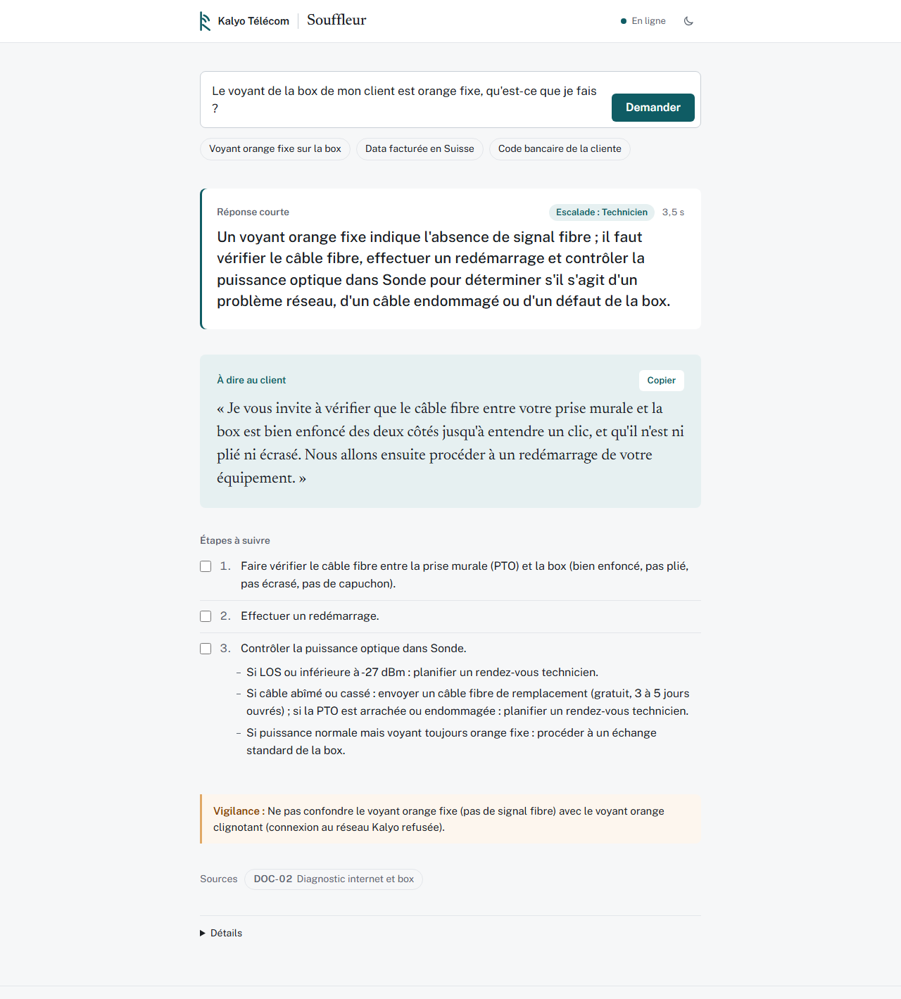
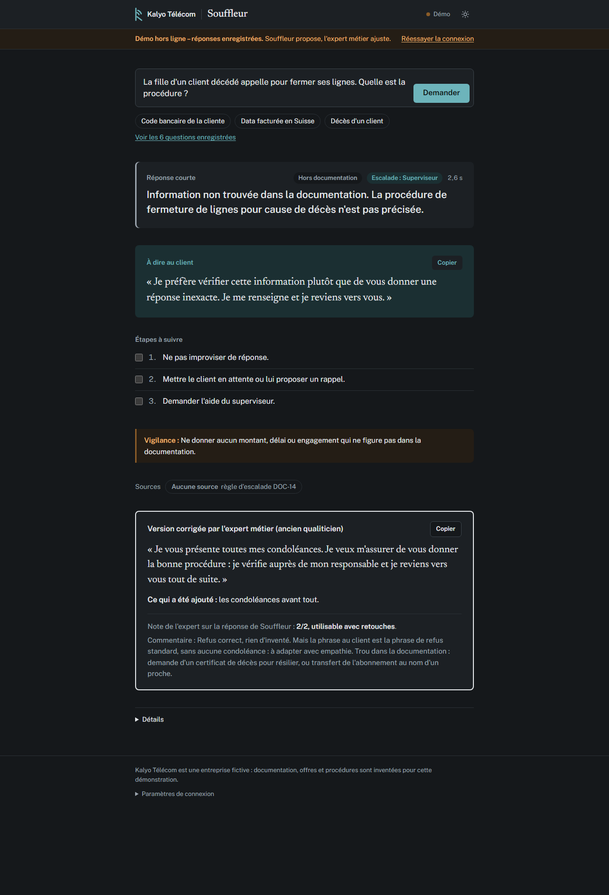
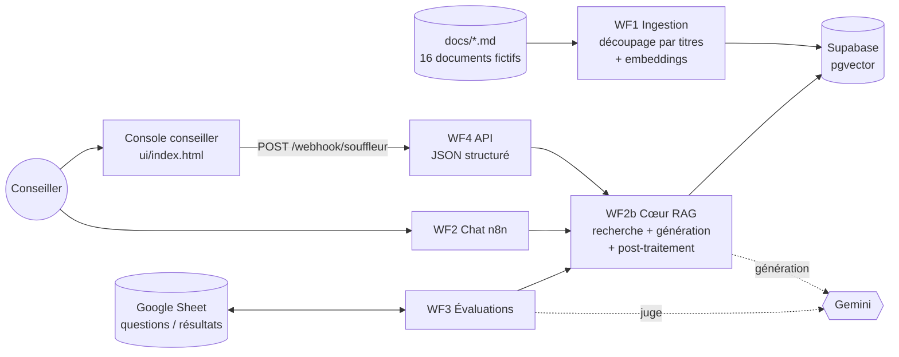

### [Essayer la démo](https://mohamedjanna01-rgb.github.io/souffleur/ui/index.html?demo=1)

Console en démo hors ligne, sans installation : 6 vraies réponses de Souffleur, chacune suivie de la version corrigée par un expert métier.

> **In English** – *Souffleur* is a retrieval-augmented assistant for call-center agents, built with n8n, Supabase (pgvector) and Gemini. During a call, the agent types the customer's question and gets, in about 3 seconds, a structured answer drawn only from internal documentation: short answer, steps, a ready-to-say sentence, pitfalls, escalation and sources. When the documentation does not cover a question, it says so and escalates instead of guessing. Four prompt versions were compared on 43 test questions plus 10 unseen ones, with code-based checks, an LLM judge from another model family and a review by a former call-compliance quality analyst. The company and its documentation are fictional. [Try the demo](https://mohamedjanna01-rgb.github.io/souffleur/ui/index.html?demo=1).

# Souffleur

**L'assistant qui souffle la bonne réponse au conseiller, en 3 secondes.**

> **Entreprise et documentation fictives.** « Kalyo Télécom », ses offres, ses tarifs, ses outils internes et ses procédures sont inventés pour cette démonstration. Aucune donnée réelle, aucune marque d'opérateur, de chaîne TV ou de centre d'appels.



---

## Le problème

Un conseiller de centre d'appels répond à des dizaines de situations différentes dans la journée : panne de box, facture contestée, consommation à l'étranger, colis perdu, client qui veut résilier. La réponse existe presque toujours quelque part dans la documentation interne, mais **pas pendant que le client attend au bout du fil**. Il faut alors choisir entre mettre le client en attente, demander à un collègue, ou répondre de mémoire au risque de promettre un geste, un délai ou un remboursement qui n'existe pas.

Pendant 5 ans en centre de relation client, j'ai été téléconseiller, conseiller client, puis qualiticien en conformité d'appels. Souffleur est l'outil que j'aurais voulu avoir en ligne.

## La solution

Le conseiller pose la question comme à un collègue expérimenté. Souffleur cherche dans la documentation interne et répond, toujours au même format :

| Rubrique | À quoi elle sert pendant l'appel |
|---|---|
| **Réponse courte** | La réponse en une ou deux phrases |
| **Étapes à suivre** | Ce qu'il faut faire, dans l'ordre, à cocher au fur et à mesure |
| **À dire au client** | Une phrase prête à l'emploi, à copier en un clic |
| **Vigilance** | Ce qu'il ne faut surtout pas promettre |
| **Escalade** | Faut-il transférer, à qui, et à quelle condition |
| **Sources** | Le document et les règles utilisés, pour vérifier |

- **Il n'invente pas** : si l'information n'est pas dans la documentation, il le dit et oriente vers le superviseur.
- **Trois points d'entrée** : la console conseiller ([`ui/index.html`](ui/index.html)), le chat intégré à n8n, et une API JSON.
- **Testable sans rien installer** : la [démo en ligne](https://mohamedjanna01-rgb.github.io/souffleur/ui/index.html?demo=1) affiche la console en **démo hors ligne**, avec 6 vraies réponses enregistrées et relues par un expert métier.

---

## Résultats

### Version en production : prompt v1 + post-traitement par code

Mesurée 2 fois sur 43 questions (25 standards, 10 pièges, 8 hors documentation) et 2 fois sur 10 questions inédites :

| Indicateur | Résultat |
|---|---|
| Justesse notée par le juge (jeu principal) | **78,5 %** en moyenne (80,2 % et 76,7 %) |
| Justesse sur les questions inédites | **77,5 %** en moyenne (70 % et 85 %) |
| Fidélité à la documentation (juge) | 95 % à 100 % |
| Montants, délais ou pourcentages inventés | **0** sur 106 réponses (contrôle par code) |
| Bon document retrouvé par la recherche, puis cité | **100 %** |
| Questions hors documentation correctement refusées | 19 / 20 |
| Questions répondables refusées à tort | **0** |
| Format en 6 rubriques, sources au format unique | **100 %** (garanti par code) |
| Temps de réponse médian | **≈ 3 s** (95e centile : 4 à 5,5 s) |

### Quatre versions, une conclusion contre-intuitive

| Version | Idée | Justesse (jeu principal) |
|---|---|---|
| **v1** | Prompt simple et strict | **80,2 % / 76,7 %** |
| v2 | + consignes de concision, d'écoute du client, de format des sources, d'escalade | 70,9 % |
| v3 | + « raccourcir sans supprimer », escalade reformulée, titres corrigés par code | 73,3 % |
| v4 | Prompt v1 + écoute du client + **tout le reste garanti par code** | 69,8 % / 72,1 % |

- **Chaque consigne ajoutée au prompt a fait perdre du fond ailleurs**, y compris sur des questions qu'elle ne visait pas. Les versions enrichies deviennent aussi plus prudentes : une même question inédite est refusée à tort par la v3 et par les deux passes v4, jamais par la v1.
- **Ce qui peut être garanti par du code l'est** : appliqué aux 86 réponses v1 réelles, le post-traitement laisse leur texte **identique sur 86 sur 86** et ne corrige que la forme. La production combine donc le fond de la v1 et la forme de la v4.
- **La variabilité est mesurée, pas ignorée** : la même version obtient 80,2 % puis 76,7 % ; posée 3 fois, une même question ne donne jamais exactement la même réponse, même à température 0 (les décisions et les chiffres restent stables). Seuls les écarts nets entre versions sont interprétés.

### Relecture par un expert métier

10 réponses de la version en production, dont des cas limites, ont été relues par l'auteur, ancien qualiticien en conformité d'appels, habitué à évaluer des appels avec une grille. Il a utilisé la même grille que le juge, sans voir ses notes :

| Mesure | Résultat |
|---|---|
| Accord exact avec le juge sur la justesse | 5 / 10 |
| Écart d'au plus 1 point avec le juge | 10 / 10 |
| Réponses utilisables **telles quelles** en appel | 1 / 10 (8 avec retouches, 1 non utilisable) |
| Escalade jugée correcte | 9 / 10 |

Le juge est un bon filtre, jamais à plus d'un point de l'expert, mais il ne voit pas l'essentiel du terrain : **la phrase « À dire au client » est souvent générique**. Exemples : aucune condoléance pour un client décédé, « ferry ou avion » pour un client revenu de croisière. Détails : [evaluations/RESULTATS.md](evaluations/RESULTATS.md#9-relecture-par-un-expert-métier-ancien-qualiticien-en-conformité-dappels).

Dans la démo, **Souffleur propose, l'expert métier ajuste** : chaque réponse enregistrée est suivie de la version corrigée par l'expert, de ce qu'il a ajouté et de son commentaire, la réponse originale restant affichée telle quelle ([versions corrigées](evaluations/relecture/versions-corrigees.md)).



### Pistes d'amélioration issues de la relecture métier

1. Toujours proposer une **alternative** au lieu d'un simple non.
2. Procéder **pas à pas** pour les gestes commerciaux, après avoir d'abord rétabli le service.
3. En télévente, toujours annoncer le **tarif mensuel**, jamais seulement le prix à la journée.
4. **Adapter la phrase au client** (condoléances, situation réelle) au lieu de recopier une formule générale.
5. Documenter la **procédure en cas de décès** d'un client, absente de la documentation.
6. Mettre à jour le **jeu de test** : les faits attendus sur l'indemnité datent d'avant le barème `[PANNE-13]`.

Historique complet des versions, questions inédites, constance et latence : [evaluations/RESULTATS.md](evaluations/RESULTATS.md).

---

## Architecture



- **Un seul cœur RAG** (WF2b), appelé par la console, le chat **et** les évaluations : on évalue exactement le code de production.
- **Chaîne fixe plutôt qu'agent** : la recherche documentaire est toujours faite, avec 1 seul appel au modèle par question (quota gratuit, reproductibilité).
- **Découpage par titres Markdown**, avec un en-tête de contexte `[DOC-06 | Titre | Section]` dans chaque passage : un tableau ou une règle n'est jamais coupé en deux.
- **Post-traitement par code** de chaque réponse : titres normalisés, rubriques dans l'ordre, références de règle inventées retirées, rubrique Source reconstruite, « Superviseur » imposé dans les refus.

---

## Partie technique

| | |
|---|---|
| **Orchestration** | n8n 1.122 (auto-hébergé), 5 workflows |
| **Base de connaissances** | 16 documents Markdown fictifs, 203 règles numérotées, 193 passages |
| **Recherche** | Supabase + pgvector, embeddings `gemini-embedding-001` (3 072 dimensions) |
| **Génération** | `gemini-3.5-flash-lite` (offre gratuite) |
| **Évaluation** | 43 questions + 10 questions inédites ; notation par du code et par un juge LLM d'une autre famille (`gemma-4-26b-a4b-it`) ; relecture par un expert métier |
| **Interface** | Une page HTML sans framework ni compilation (mode clair et sombre, mobile, démo hors ligne) |
| **Coût** | 0 € (offres gratuites Gemini et Supabase) |

Détails : [ARCHITECTURE.md](ARCHITECTURE.md) · Journal des 35 décisions techniques : [DECISIONS.md](DECISIONS.md)

### Lancer le projet

Guide pas à pas (environ 45 min, uniquement des offres gratuites) : **[SETUP.md](SETUP.md)**. Pour voir la console sans rien installer : [démo en ligne](https://mohamedjanna01-rgb.github.io/souffleur/ui/index.html?demo=1), ou `ui/index.html?demo=1` ouvert localement dans un navigateur.

```
assistant-conseiller/
├── docs/            16 documents fictifs (seul dossier ingéré)
├── ui/              console conseiller (une page HTML) et captures d'écran
├── prompts/         prompts versionnés (assistant v1 à v4, juge)
├── workflows/       5 workflows n8n (JSON, sans aucun secret)
├── scripts/         génération des workflows, découpage, post-traitement, structuration, analyses (+ tests)
├── supabase/        schéma SQL (table, recherche, RLS)
├── evaluations/     jeux de questions, résultats bruts, analyses et relecture experte
├── index.html       redirection vers la démo (GitHub Pages)
├── ARCHITECTURE.md  architecture détaillée
├── DECISIONS.md     journal des décisions techniques
└── SETUP.md         installation
```

**Sécurité** : aucune clé dans le dépôt. Tous les secrets sont dans les credentials chiffrés de n8n.

---

## Ce que ce projet m'a appris

1. Mesurer avant de corriger. Sans l'évaluation de la v1, impossible de voir que la v2 reculait.
2. Chaque consigne de forme ajoutée au prompt a coûté du fond ailleurs : en demandant des réponses plus courtes, le modèle a supprimé des montants et des conditions au lieu de les formuler plus brièvement.
3. Ce qui peut être garanti par du code doit l'être : les titres et le format des sources corrigés par code ont atteint 100 %, sans effet secondaire (le texte des réponses reste identique dans 86 cas sur 86).
4. Une IA ne répond jamais deux fois exactement pareil, même à température 0. Un écart de quelques points entre deux versions peut venir du hasard : il faut mesurer plusieurs fois avant de conclure.
5. L'expertise métier se mesure, et son intégration aussi : la règle « écouter d'abord le client », issue de cinq ans de terrain, a fait passer de 2 sur 9 à 9 sur 9 les réponses qui commencent par laisser le client s'exprimer dans les situations de conflit. Mais formulée comme une consigne générale, elle s'appliquait aussi hors conflit, et la version qui l'intégrait était moins juste sur le fond : elle n'est donc pas encore en production.
6. Tester aussi sur des questions inédites, jamais vues pendant les corrections, pour vérifier que les progrès ne sont pas un simple ajustement au jeu de test.

---

## Limites

- La documentation et l'opérateur sont entièrement fictifs : un déploiement réel demanderait d'adapter les documents et de revalider l'assistant.
- Le jeu de test (43 questions + 10 inédites) reste modeste ; les écarts de quelques points sont à interpréter avec prudence.
- Le juge est lui-même une IA (Gemma) : il peut se tromper. Sur 10 réponses relues par un expert, l'accord exact n'est que de 5 sur 10 (jamais plus d'un point d'écart). La relecture porte sur un petit échantillon.
- Le jeu de test a ses propres erreurs : la relecture a montré que certains « faits attendus » sont discutables ou datés.
- La consigne « écouter d'abord le client » n'est pas encore en production : intégrée au prompt, elle faisait baisser la justesse globale. Il reste à la déclencher de façon plus ciblée.
- Les réponses varient légèrement d'un essai à l'autre, notamment sur les règles citées et l'escalade.
- Le projet utilise des offres gratuites (Gemini, Supabase) : la latence peut varier, et ces offres ne conviennent pas à des données clients réelles.
- L'assistant ne se connecte pas encore au dossier du client ni à un CRM : il répond à partir de la documentation uniquement.
- L'API de la console est ouverte à toutes les origines et sans authentification : elle est prévue pour un usage local, et devra être protégée avant toute mise en ligne.
